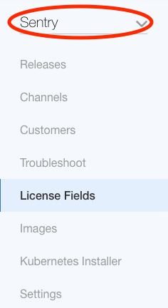
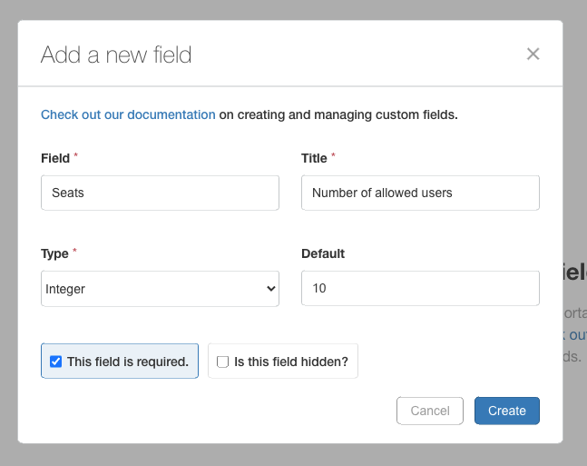
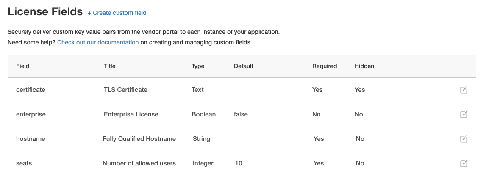
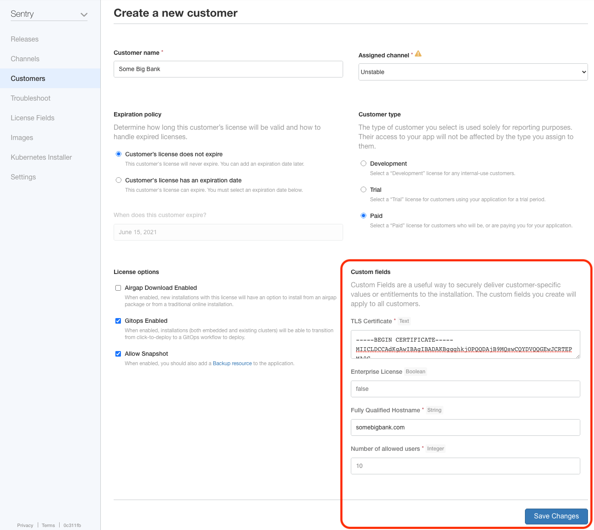
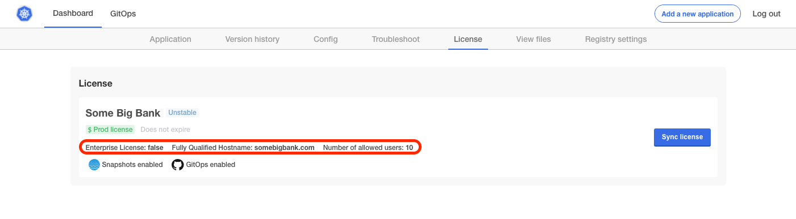

# License Custom Fields
Custom fields in licenses allow adding metadata into the license file. The information in the license is exposed to the applications inside KOTS.

Examples are
* **seats** for the number of seats on a license
* **hostname** if restricting the application to a specific domain

Custom license fields are generally created and managed from the [License Fields section](https://vendor.replicated.com/license-fields) of the vendor portal. Any new Required field will need to be set for all existing Customers (either with custom data or by using the Default value) as well as all future Customers. Fields that are marked as Hidden will not be displayed on the :8800/license page of the on-prem admin console. Title will be the name that is displayed on the :8800/license page of the on-prem console. Field is the unique id. Type is either an ‘integer’, ‘string’ or ‘text’ type.

These values are available in the on-prem instance and can be used to configure or alter the application. During configuration, these fields can be read from the [template functions](https://help.replicated.com/docs/kubernetes/packaging-an-application/template-functions#licensefieldvalue) and then used to overwrite config files or be injected as environment variables. Once the application is running, these values are synced automatically on the update check interval. Changes can be detected in the running instance by polling the [Licensing Integration API](https://replicated.readme.io/docs/license-api).

These fields are cryptographically signed by Replicated using PKI and the Replicated components will not install or update the license fields if the data does not match the signature.

> Note: You can’t delete a license field in the vendor portal but you can with an API call `https://api.replicated.com/vendor/v1/app/:appId/licensefield/:licenseFieldName`

# In this Tutorial
Learn to create custom fields and see how they are exposed to your application.

# Prerequisites

* An [app](todo) created in the [Vendor Portal](todo)

# Instructions

1. Click the **Applications** menu option at the top of the Vendor Portal

    

1. Select your application from the drop down menu on the upper left

    

1. Click the **License Fields** menu option on the left

    

## Adding a Custom Field

1. Click the **+ Create custom field** link in the top left

    

1. Fill out the **Add a new field** prompt by providing the following information:

    * **Field** - the name of the field. This will show up in the license file and can by read by a KOTS app

        > CAUTION: **Field** should be an alpha-numeric with no spaces.

        > CAUTION: The **Field** name cannot be changed after creating the custom field

    * **Title** - a short description which will be part of the user experience when creating or editing a customer

    * **Type** - the data type of the field. Options include:
        * Integer - A whole number
        * String - A single-line set of text
        * Text - A multi-line set of text
        * Boolean - True or False

        > CAUTION: The **type** cannot be changed after creating the custom field

    * **Default** - a default value. This can be left blank.

        > CAUTION: The default value is used for existing customers where the custom field didn't previously exist.

    * **Is this field required?** - a customer cannot be created or edited without this field having a value

        > CAUTION: **Is this field required?** cannot be changed after creating the custom field

        > Note: This is set to the default value on previously existing customers. If the default is blank, then a value will be required the next time that customer's information is edited.

    * **Is this field hidden?** - this field will be hidden from the customers view in the **KOTS Admin Console** under **License**. This is visible when creating or editing a customer in the Vendor Portal.

        > CAUTION: Hidden fields still appear in the license file

    

1. Click **Create**

1. Review the custom fields you have created. A list of the custom fields for your application will be listed.

    
    This example shows several types of custom fields.

## Editing a Custom Field

1. Click the **edit** icon to the right of the custom field

    

1. Fill out the Edit field prompt

    > Note: the **Field**, **Type**, and **This field is required** elements are read-only

    

1. Click **Update**

## Creating a Customer with Custom Fields

1. Fill out the **Custom fields** section when creating a new customer

      > Note: You will not be able to **Save Changes** if required fields are left blank

      

1. See [Creating a Customer](todo) for more information

## Viewing the License Information

There are three places where license information can be viewed.

* The Vendor Portal
* The license file
* The KOTS Admin Console

> Note: Values in the license can only be edited in the Vendor Portal. The license file is cryptographically signed by Replicated using PKI and the Replicated components will not install or update the license fields if the data does not match the signature.

> Note: Hidden values are shown in the license file

### Vendor Portal

1. Follow the [Customer tutorial](todo) to view a customer's information. This information will be present

### The License File

1. Follow the [Customer tutorial](todo) to download the license

1. Open the license in a text editor

    > Note: Hidden values are shown in the license file

    ```yaml
    apiVersion: kots.io/v1beta1
    kind: License
    metadata:
      name: somebigbank
    spec:
      appSlug: sentry-bream
      channelID: 1qtlxxxxxxxxxxxxxxxxxxxEho0
      channelName: Unstable
      customerName: Some Big Bank
      endpoint: https://replicated.app
      entitlements:
        certificate:
          isHidden: true
          title: TLS Certificate
          value: |-
            -----BEGIN CERTIFICATE-----
            MIICLDCCAdKgAwIBAgIBADAKBggqhkjOPQQDAjB9MQswCQYDVQQGEwJCRTEPMA0G
            ...
            l4wOuDwKQa+upc8GftXE2C//4mKANBC6It01gUaTIpo=
            -----END CERTIFICATE-----
          valueType: Text
        enterprise:
          title: Enterprise License
          value: false
          valueType: Boolean
        expires_at:
          description: License Expiration
          title: Expiration
          value: ""
          valueType: String
        hostname:
          title: Fully Qualified Hostname
          value: somebigbank.com
          valueType: String
        seats:
          title: Number of allowed users
          value: 10
          valueType: Integer
      isGitOpsSupported: true
      isSnapshotSupported: true
      licenseID: 1u0Uxxxxxxxxxxxxxxxxxxxv9F5
      licenseSequence: 1
      licenseType: prod
      signature: eyJsaWNlbnN...
    ```

    An example license file

### The KOTS Admin Console

> Note: All fields are visible except **hidden** fields

1. Open the [KOTS Admin Console](todo)

1. Navigate to Dashboard --> License to observe license information.

    

    The **TLS Certificate** field is not visible because it is hidden in this example.

## Exposing Custom Fields to your application

1. Use the `LicenseFieldValue` template function in your application manifests in the Vendor Portal.

    For example, exposing the `seats` custom field

    ```yaml
    repl{{ LicenseFieldValue "seats" }}
    ```

    Here is a more detailed example of a `deployment` exposing a custom field as an environment variable.

    ```yaml
    apiVersion: apps/v1
    kind: Deployment
    metadata:
      name: api
    spec:
      selector:
        matchLabels:
          app: api
      template:
        spec:
          containers:
          - image: myapp/api:v1.0.1
            name: api
            env:
              - name: SEATS
                value: repl{{ LicenseFieldValue "seats" }}
    ```
