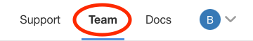
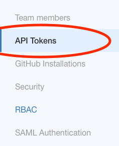
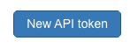
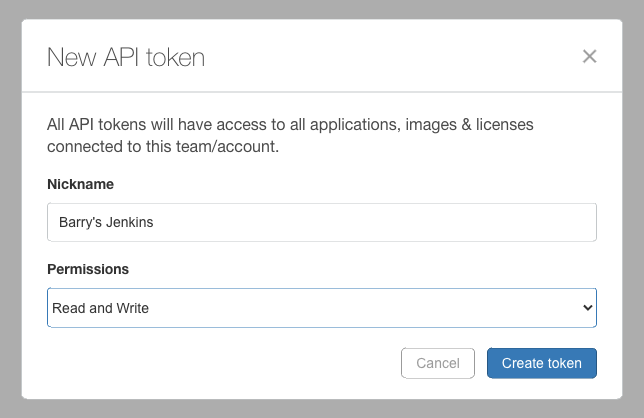
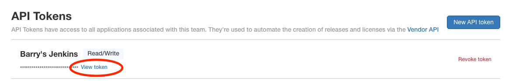
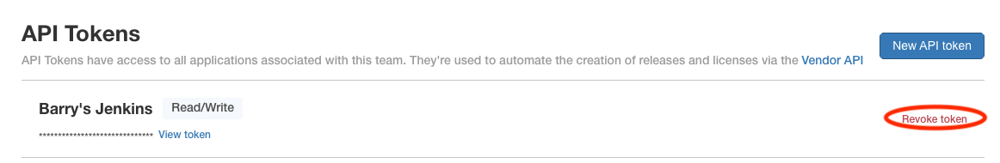
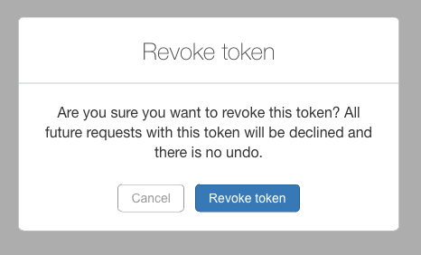

# API tokens
Tokens are used for programmatic access to Vendor Portal functions.

The most common use case is for programmatically creating and promoting releases, as well as creating customers and licenses. This is useful for CI/CD systems or other automations.

Permissions define the CRUD access for APIs

* `Read` permission allows the user to only read the state of objects
* `Read/Write` permission allows the user to create, update, and delete objects.

# In this Tutorial
Learn how to create, view, revoke and use API tokens.

# Prerequisites

* [Admin](rbac.md) access to a [vendor account](todo)
* Access to an environment where the [`replicated` CLI](todo) is installed.

# Instructions

1. Log into the [Vendor Portal](https://vendor.replicated.com), if prompted

1. Navigate to the Team menu at the top right of the Vendor Portal

    

## Create an API Token

1. Navigate to the [API Tokens Menu](https://vendor.replicated.com/team/tokens) on the left

    

1. Click the `New API Token` button in the top right

    

1. Fill out the prompt. Provide the following information:

    * **The token name**. This should describe where this token is used.

    * **The permission desired**. The desired permissions for users of this token.

    

1. Click `Create Token` to create the token.

## View the Token

1. Find the token in the list

1. Click the `View token` link to reveal the token.

    > Note: you will use this token later

    


## Use a Token

1. Open your command shell

1. Set the `REPLICATED_API_TOKEN` environment variable

    ```shell
    export REPLICATED_API_TOKEN=0a0baXXXXXXXXXXXXXXXXXXXXXXXXXX
    ```

1. Test the token by listing your apps

    > Note: the `replicated` CLI must be installed

    ```shell
    replicated app ls
    ```

    You should now see a list of your apps which might look something like this:

    ```
    ID                             NAME       SLUG               SCHEDULER
    1qtlXXXXXXXXXXXXXXXXXXXXXXX    Sentry     sentry-XXXXX       kots
    ```

## Revoke a Token

1. Find the token in the list

1. Click the `Revoke token` link

    

1. Click the `Revoke token` button in the prompt

    > CAUTION: This will delete your token

    
