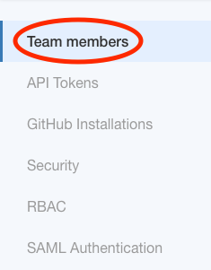
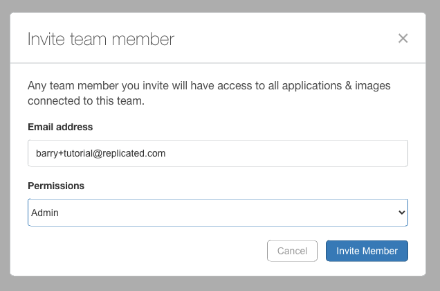
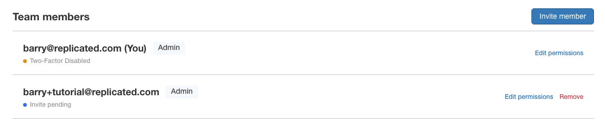
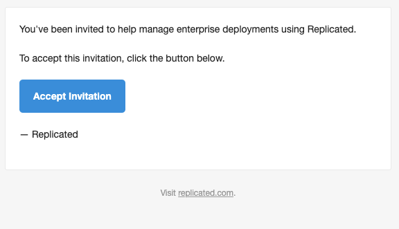
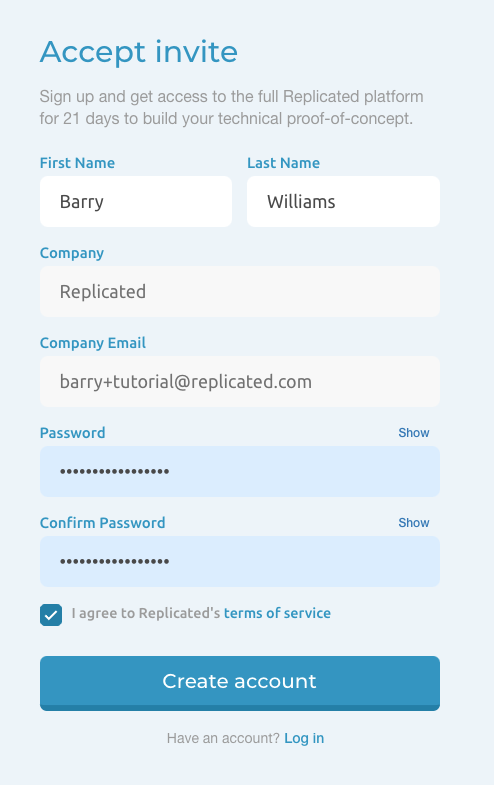
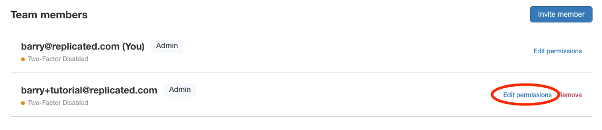
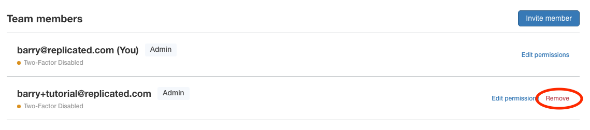
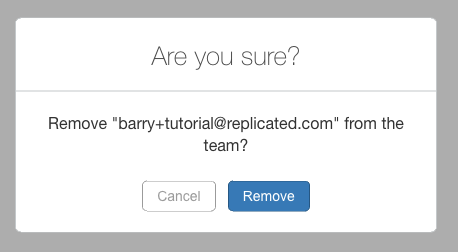

# Team Members
Team members are those who are given access to the vendor portal. An administrator or someone given the permissions will invite others to join the team, specifying what permissions are given to that new member.  

# In this Tutorial
Learn how to

* Invite a new member
* Setup an account as the new member
* Change a member's permissions
* Remove a member

# Prerequisites

* [Admin](rbac.md) access to a [vendor account](todo)
* An email address used to invite another member.
    > **WARNING: Currently an email address can only be associated with one vendor team. A [temporary email address](https://www.sharklasers.com/inbox) or [email alias](https://gmail.googleblog.com/2008/03/2-hidden-ways-to-get-more-from-your.html) (if supported by your provider) is recommended if just testing this feature.**

# Instructions

1. Log into the [Vendor Portal](https://vendor.replicated.com), if prompted

1. Navigate to the Team menu at the top right of the Vendor Portal

    

## Invite a new member

1. Navigate to the [Team Members menu](https://vendor.replicated.com/team/tokens) on the left

    

1. Click the `Invite member` button on the right

    

1. Fill out the prompt. Provide the following information:

    * **Email address** of the new member
        > **WARNING: Currently an email address can only be associated with one vendor team. A [temporary email address](https://www.sharklasers.com/inbox) or [email alias](https://gmail.googleblog.com/2008/03/2-hidden-ways-to-get-more-from-your.html) (if supported by your provider) is recommended when only testing this feature.**

    * **Permissions** of the new member - this is the [RBAC policy](rbac.md) assigned to the new member

    

1. Click the `Invite Member` button. An invitation email will be sent to that new member

1. Find the new member in the list of members

    > Note: See that the new member's status is "Invite pending"

    

## Setup an account as the new member

1. Ensure you have logged out of the Vendor Portal.

    > Note: Logging out is important, as accepting the invite will not be recognized if you are logged in as someone else

    1. Click your user icon in the top right. This will present an account menu

    1. Click `Log out`

1. Check the email of the new member. Expect a new email from Replicated with an invitation to the team

    

1. Click the `Accept Invitation` button. You will be taken to another page

1. Fill out the Accept Invite prompt by providing the following information:

    * **First Name**
    * **Last Name**
    * **Password** and **Confirm Password**
    * **Accept the terms of service**

    > Note: The Company and Company Email fields are read-only

    

1. Click `Create account`

1. Expect to be logged in to the Vendor Portal as the new member

## Change a member's permissions

 CAUTION: You cannot operate on the member you are logged in with. Click to expand for instructions on how to change users.

    1. Click your user icon in the top right. This will present an account menu

    1. Click `Log out`

    1. Log in as an `admin` user that is different than the user you wish to operate on

1. Navigate to the Team menu at the top right of the Vendor Portal

    

1. Navigate to the [Team Members menu](https://vendor.replicated.com/team/tokens) on the left

    

1. Click the `Edit permissions` link on the right of the member you wish to operate on

    >Note: You cannot operate on the user you are logged in with.

    

1. Click the `Permissions` drop down menu and select the policy you wish to apply to that member

    The default policies are the following:

    * Admin
    * Read Only

    >Note: to add more policies, please follow the [RBAC tutorial](rbac.md)

    

1. Click `Save` to apply the policy to the member

## Remove a member

 CAUTION: You cannot operate on the member you are logged in with. Click to expand for instructions on how to change users.

    1. Click your user icon in the top right. This will present an account menu

    1. Click `Log out`

    1. Log in as an `admin` user that is different than the user you wish to operate on

1. Click the `Remove` link on the right of the member in the list you wish to operate on

    

1. Click the `Remove` button in the prompt to remove the member

    > CAUTION: This will remove the member

    

1. Observe that the user is no longer in the members list

# See Also

[Integration with SAML](saml.md)

[Custom Policies](rbac.md)

[User Security Policies](security.md)
