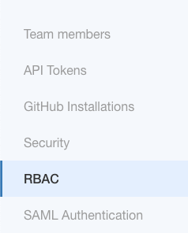
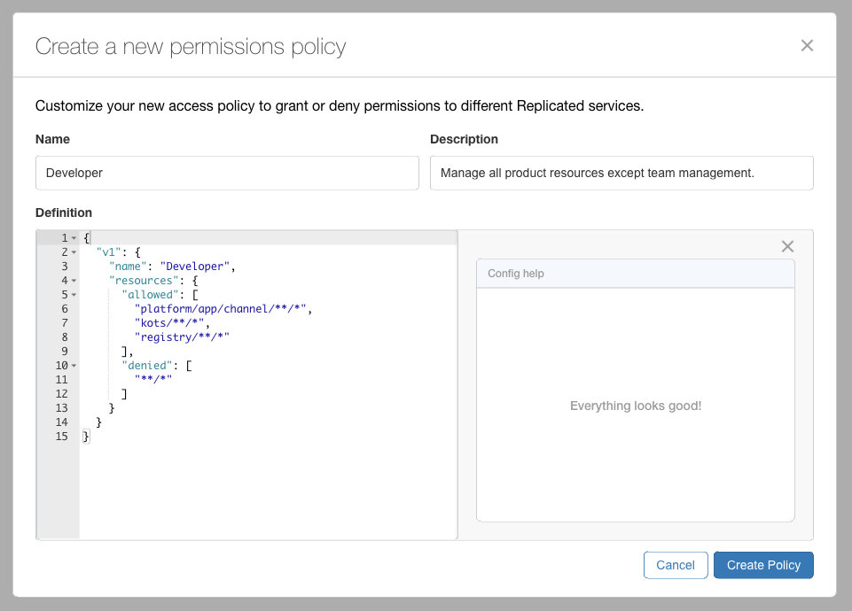
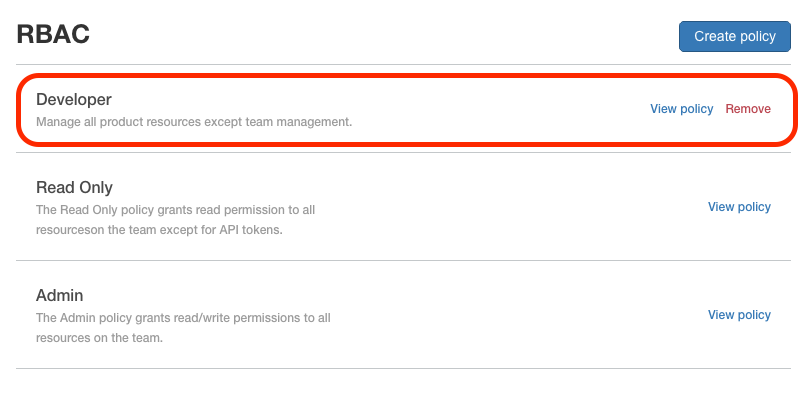
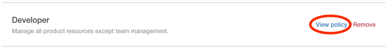
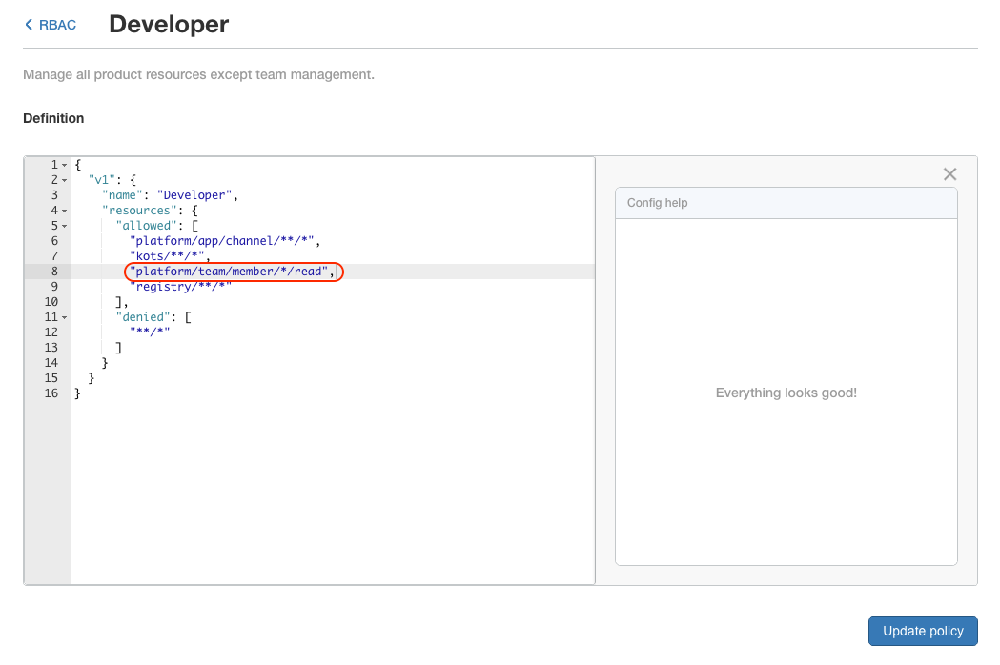
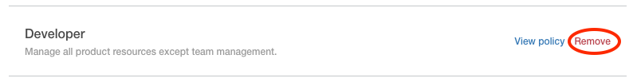
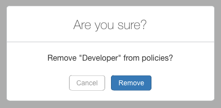

# Role Based Access Control (RBAC) in the Vendor Portal
RBAC is a way of defining policies with a set of permissions and then applying that policy to select team members. This permits following the principles of least privilege.

Some examples of least privilege use cases are the following:
* A developer who has the ability to create and promote releases, but cannot create customers and licenses
* An auditor who only has read access to view everything
* An admin user with full read/write access - even managing other team members

New Vendor Portal accounts come with two policies:
* **Read Only** - read permission to all resources on the team except for API tokens.
* **Admin** - read/write permissions to all resources on the team.

See the [RBAC resource names documentation](https://help.replicated.com/docs/vendor-rbac/resource-names/) for a full list of resource names.

>Note: This tutorial applies to RBAC in the Vendor Portal - not RBAC in Kubernetes.

# In this Tutorial

Learn how to create a developer policy and apply it to members on the vendor team. This policy will be allowed to manage all resources except team members. Later in the tutorial we will edit the policy to allow reading the team members, but not permit any other team member actions.

# Prerequisites

* Logged into a [vendor account](todo) as a member with an `admin` policy
* Additional [team members](members.md) where policies will be applied

# Instructions

## Navigation


1. Log into the [Vendor Portal](https://vendor.replicated.com), if prompted

1. Navigate to the Team menu at the top right of the Vendor Portal

    

1. Click the **RBAC** menu on the left

    

## Create a Permissions Policy

A **developer** policy will be created. This policy will be allowed to manage all resources except team members.

1. Click the **Create policy** button

    

1. Fill in the **Create a new permissions policy** prompt

    Provide the following information:
    * Name - a simple name for the policy
    * Description - a short description of what the policy permits or denies
    * Definition - a JSON object that defines the policy. See the [RBAC resource names documentation](https://help.replicated.com/docs/vendor-rbac/resource-names/) for a full list of resource names.

    > Note: The **Config help** section is used to validate your definition

    In this example, we will use the following policy definition for our developer policy

    ```json
    {
      "v1": {
        "name": "Developer",
        "resources": {
          "allowed": [
            "platform/app/channel/**/*",
            "kots/**/*",
            "registry/**/*"
          ],
          "denied": [
            "**/*"
          ]
        }
      }
    }
    ```

    > Note: this policy definition does not allow policy members to view details about any team member. We will change this in the **Edit a Permissions Policy** section below.

    

1. Click the **Create Policy** button

1. Observe that the new **Developer** policy exists in the policy list

    

## Edit a Permissions Policy

In this example, developers are happy that they can do everything they need, but would like permission to view the list team members. Let's permit this view, but only with read access.

1. Click the **View policy** link to the right of the policy

    

1. Edit the policy definition

    In this example, We will add a resource which permits reading all members.

    ```json
    "platform/team/member/*/read"
    ```

    Here is what our policy definition will look like after this addition.

    ```json
    {
      "v1": {
        "name": "Developer",
        "resources": {
          "allowed": [
            "platform/app/channel/**/*",
            "kots/**/*",
            "platform/team/member/*/read",
            "registry/**/*"
          ],
          "denied": [
            "**/*"
          ]
        }
      }
    }
    ```

    

1. Click **Update policy**

1. Click the **<RBAC** link in the upper left to return to the list of policies

    

## Apply a policy to a team member

See the **Change a member's permissions** section in the [Members tutorial](members.md)

## Remove a policy

1. Click the **Remove** link to the right of the policy

    

1. Click the **Remove** button in the prompt

    

    > CAUTION: This will remove the policy

    > Note: you will not be able to remove the policy is applied to any team members.
