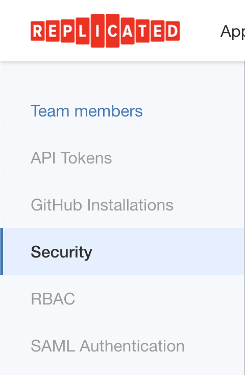
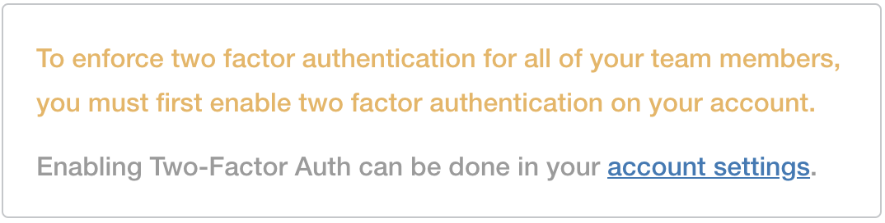
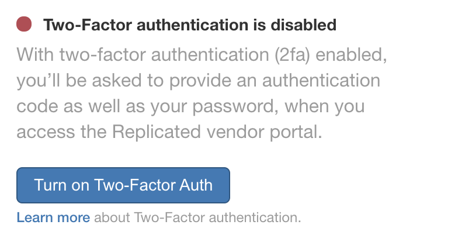
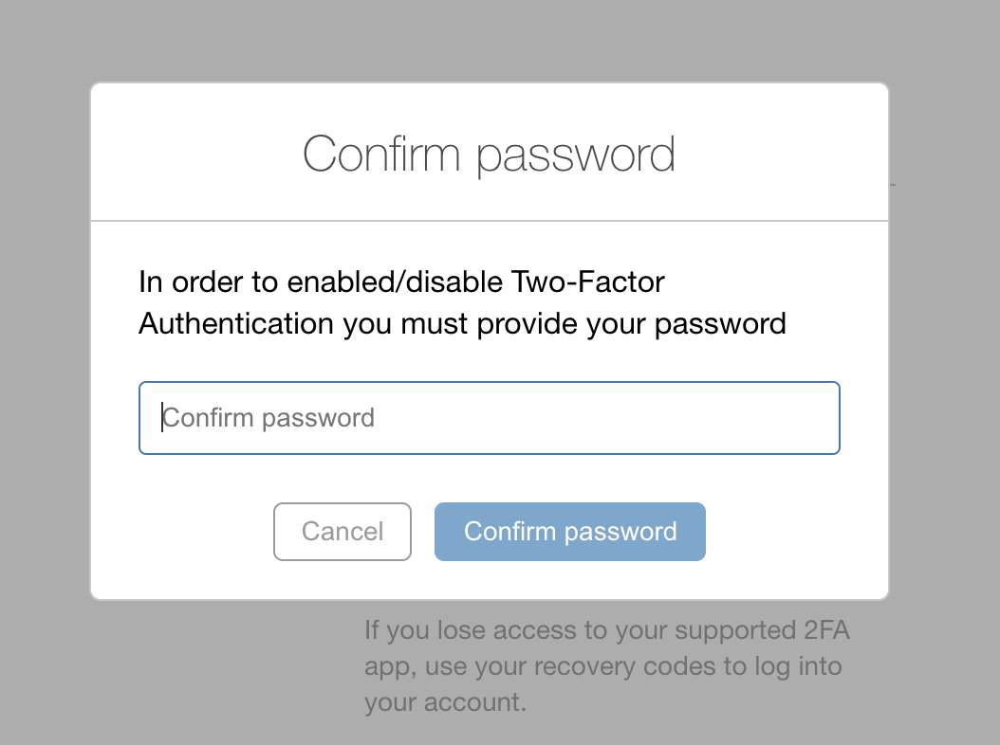
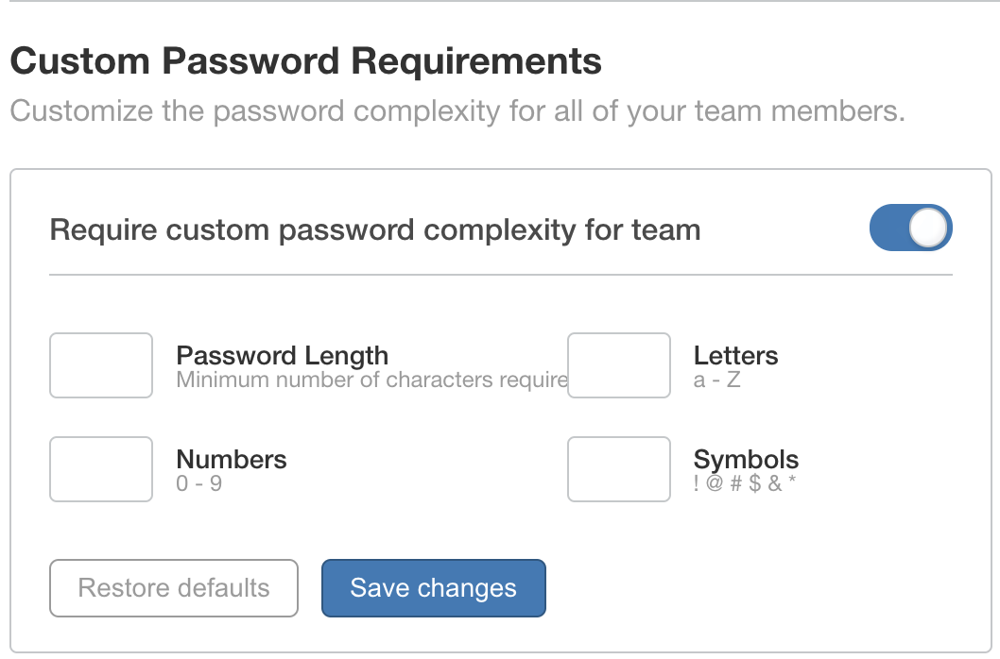

# Security Requirements
Security is a core principal here at Replicated.  You can help increase the
security of your team's account by enforcing [strong passwords](#strong-passwords)
and enabling [Two-Factor Authentication](#two-factor-authentication)

# Enabling security measures
1. Log into the [Vendor Portal](https://vendor.replicated.com), if prompted

1. Navigate to the Team menu at the top right of the Vendor Portal

    

1. Click on the **Security** menu on the left

    

## Two-Factor Authentication
In order to enforce 2FA logins for your team members, you must have the 2FA
option enabled in your organization's Account Settings.

1. Click on the **account settings** link to be taken to the settings page

    

1. Under the section "Two-factor authentication", click the "Turn on Two-Factor
Auth" button

    }

1. Confirm your account password

    

1. Follow the instructions on the screen to configure your 2FA device

    

>Note:  If SAML authentication is configured for your team, Two-Factor Authentication will be bypassed. You can leave it enabled but you will not be prompted to enter a code when logging in.

## Strong Passwords
You can enforce strong passwords for all your team by requiring that all
passwords meet certain requirements for complexity.

1. Check the box next to "Require custom password complexity for team"

    

1. Use the controls to set a minimum password length and required # of letters,
digits, and symbols.

1. Click "Save Changes"

